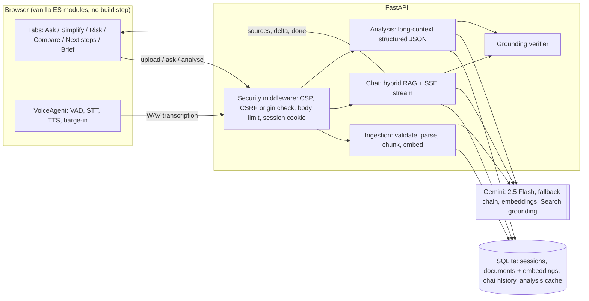

# LexiGuide: a grounded, voice-first legal document assistant

LexiGuide makes legal documents understandable and actionable. Upload a contract, notice,
policy, spreadsheet, scanned page or voice note, then **talk to it hands-free** or use the
built-in tools to simplify, risk-scan, compare, plan next steps and prepare a lawyer brief.

Every claim about your documents is **cited to the exact clause**, and every quote is
**checked word-for-word against the original text** before you see it. Nothing is invented
silently: if a quote cannot be found, the UI tells you.

Built with **Google Gemini** (`google-genai` SDK), FastAPI and dependency-free vanilla JS.

---

## Problem statement coverage

| Use case in the brief | Where it lives in LexiGuide |
|---|---|
| Simplifying complex legal documents | **Simplify** tab: three reading levels, section-by-section walkthrough, glossary, 19 answer languages |
| Comparing contracts, agreements or policies | **Compare** tab: every material difference, which version is better *for your role*, what to negotiate |
| Highlighting clauses, obligations, risks, inconsistencies | **Risk scan**: 0-100 risk score, clause ratings with suggested wording, obligations, deadlines, red flags, internal contradictions, missing protections |
| Answering questions based on provided documents | **Chat** tab: hybrid RAG, streaming answers with clickable `[S1]` citations, optional Google Search grounding for current law |
| Understanding options and next steps | **Next steps**: legal position, statutes relied on, options with pros/cons/effort, prioritised checklist, every deadline |
| Summaries, checklists, actionable outputs | Every result exports to **Word (.docx)**, Markdown or print/PDF; checklists are interactive |
| Preparing questions for a legal professional | **Lawyer brief**: case summary, timeline, key facts, legal issues and sharp questions |

Beyond the brief:
- **Chat history** saved in SQLite: every conversation (with its citations and verification
  results) is listed in the sidebar and can be reopened, renamed or deleted.
- **Large documents**: up to 1,500 pages and 50 MB per file; chat uses hybrid retrieval over
  every page.
- **Hands-free voice conversation** with no push-to-talk (see below).
- **Voice notes and dictation** in any language, transcribed by Gemini.
- **Personalised analysis** for your role (tenant, employee, freelancer...) and jurisdiction.
- **One-click sample documents** (an unfair and a revised rental agreement) to try every tool.

## How LexiGuide avoids hallucinations

1. **Grounded prompts.** Document excerpts go to the model as numbered `<source>` blocks.
   The system prompt requires inline `[S#]` citations and verbatim quotes for amounts, dates
   and obligations, and an explicit "the documents don't cover this" instead of guessing.
2. **Deterministic verification, no second model call.** `app/services/grounding.py` checks
   every citation id and every quoted passage against the exact source text: normalised
   exact match first, then word-trigram coverage (`verified` >= 90 %, `partial` >= 60 %).
   Elided quotes (`A ... B`) are checked fragment by fragment. One changed number turns a
   quote from *verified* into *not found*.
3. **Visible trust signals.** Each answer shows a grounding badge ("Grounded in your
   documents · 3/3 quotes verified"), and each analysis shows "48/49 quotes verified
   word-for-word". Every quote carries its own badge, and clicking a citation opens the
   source passage with the quote highlighted.
4. **Law vs. document separation.** Statements based on law rather than the documents are
   labelled **General law:** and can be grounded with Google Search, with sources listed.
5. **Whole-document analysis.** Analysis tools read the entire document through Gemini's
   long context, not just retrieved snippets, so nothing is missed.
6. **Prompt-injection hygiene.** Document text is declared as data, never instructions, and
   wrapper tags inside uploaded text are escaped so a document cannot "close" its source block.

Answers are direct and decisive, with the reasoning and the next steps. The model is told
not to pad replies with "consult a lawyer" boilerplate. The footer states once that LexiGuide
provides legal information and does not replace a licensed lawyer, as the problem statement
requires.

## Hands-free voice agent

Click **Talk** once (the browser needs one gesture for microphone permission) and just speak.

```
listening --(you pause)--> thinking --(first sentence ready)--> speaking --(done)--> listening
    ^                                                                                |
    +--------------------- you start talking (barge-in) -----------------------------+
```

- **Two recognition engines.** The browser's streaming speech recognition is used for live
  captions (Chrome and Edge). Everywhere else, LexiGuide falls back to its own voice-activity
  detector (AudioWorklet, adaptive noise floor, 0.4 s pre-roll) that cuts utterances and
  sends 16 kHz WAV to Gemini for transcription. It switches engines automatically on errors.
- **Low latency.** Answers stream over Server-Sent Events and are spoken sentence by sentence
  (Latin, Devanagari and CJK sentence endings) while the rest is still being generated.
  Voice mode uses a short answer style and no model "thinking" time.
- **Barge-in.** While the assistant is thinking or speaking, a second detector learns how loud
  its own echo is and interrupts when you speak louder than that. You can also press `Esc`.
- Shortcut: `Alt+V` toggles the conversation.

## Architecture



**Retrieval.** Structure-aware chunks (never crossing a page, with clause headings and
overlap) are indexed two ways: Gemini embeddings (`gemini-embedding-001`, 768-d, normalised)
and BM25 with light stemming and Unicode-aware tokenisation that keeps Indic vowel signs.
Rankings are fused with Reciprocal Rank Fusion, and every document is guaranteed a hit when
several are selected. Small libraries (under 40k characters) skip retrieval and send every
chunk, which is the most accurate option. Short follow-ups ("and the deposit?") are expanded
with the previous question.

**Resilience.** Each call walks a model chain (primary, then fallbacks). A model that hits its
quota (HTTP 429) is put on cooldown for the delay Gemini returns, so later requests skip it;
overloaded (5xx) or hung (timeout) models are skipped for the next one in the chain.
Chat degrades from "with Google Search" to "without Search" rather than failing, and if
embeddings are unavailable a document is still searchable by keywords.

## Supported inputs

PDF (including scanned, via Gemini OCR) · Word `.docx` · Excel `.xlsx/.xlsm` · CSV/TSV ·
PowerPoint `.pptx` · text/Markdown/JSON · HTML · e-mail `.eml` · images (PNG/JPG/WebP, OCR) ·
audio and voice notes (WAV/MP3/M4A/OGG/FLAC/WebM, transcribed) · pasted text.

Limits: **1,500 pages** and **50 MB** per file. Images, audio and scanned PDFs are read by Gemini
inline, so those are capped at 19 MB. Analysis tools read up to about 350k characters of a
document (configurable); chat retrieves from every page.

## Run it locally

Requirements: Python 3.11+ and a Gemini API key (https://aistudio.google.com/apikey).

```bash
python -m venv .venv
.venv\Scripts\activate            # Windows  (macOS/Linux: source .venv/bin/activate)
pip install -r requirements.txt
copy .env.example .env            # then put your key in GEMINI_API_KEY
uvicorn app.main:app --reload
```

Open http://localhost:8000 and click **Try samples**. API docs are at `/docs`.

> **Quota note:** a free-tier Gemini key allows only a small number of requests per model
> per day (20 for `gemini-2.5-flash` at the time of writing). The fallback chain spreads load
> across models, but for a public demo use a key with billing enabled.

## Deploy to Google Cloud Run

```bash
gcloud run deploy lexiguide --source . --region asia-south1 --allow-unauthenticated \
  --set-env-vars GEMINI_API_KEY=YOUR_KEY --memory 1Gi
```

For production, store the key in Secret Manager and use `--set-secrets GEMINI_API_KEY=gemini-key:latest`.
Cloud Run's disk is temporary, so for chat history that survives redeploys mount a volume
(for example Cloud Storage FUSE) and point `DATABASE_PATH` at it.
The image runs as a non-root user, respects `$PORT` and trusts Cloud Run's proxy headers
(so HTTPS cookies and HSTS work).

## Quality, security, efficiency, testing and accessibility

| Criterion | What was done |
|---|---|
| **Code quality** | Layered FastAPI app (routes, services, core) with a typed `LLMClient` protocol and dependency injection; all prompts in one module; `ruff` (strict rule set), `ruff format` and `mypy` clean; docstrings on every module |
| **Security** | API key server-side only (`.env` git-ignored); strict CSP with no inline scripts; `X-Frame-Options`, `nosniff`, `no-referrer`, microphone-only Permissions-Policy, HSTS on HTTPS; HttpOnly `SameSite=Strict` session cookie with fixation protection; Origin / `Sec-Fetch-Site` CSRF check; request-body cap before parsing; extension allow-list **plus** magic-byte check; zip-bomb guard for Office files; bounded parsing (pages, rows, slides); per-IP rate limit on AI endpoints; per-session isolation; no stack traces leaked; model output rendered through an escaping Markdown renderer (XSS-tested); prompt-injection escaping; `pip-audit` clean |
| **Efficiency** | Streaming SSE answers and sentence-level TTS; embedding batching (100/request, 4 in parallel) with a content-hash LRU cache; per-session SQLite cache for identical analyses (instant repeat, survives restarts); duplicate uploads de-duplicated by SHA-256; numpy vector search and an inverted-index BM25; CPU-bound parsing in worker threads; quota-aware model routing; gzip (not for SSE); no frontend framework or build step, and no third-party requests from the page |
| **Testing** | 131 pytest tests (parsers for every format, chunking, BM25/RRF/hybrid retrieval, quote verification, SQLite repositories, chat history, API end to end with a fake LLM, security controls, model routing and timeouts) at **93 % coverage**, each test on its own temporary database; 16 Node tests (XSS-safe Markdown, VAD, WAV encoding, SSE parsing, TTS sentence chunking); GitHub Actions CI runs lint, types, tests, coverage gate and dependency audit |
| **Accessibility** | Semantic landmarks and a skip link; WAI-ARIA tabs with arrow-key navigation; native `<dialog>`s; every control labelled; screen-reader announcements for streaming answers and voice state; visible focus rings; a text-size setting (4 steps); a calm beige-and-white theme with AA contrast; reduced-motion and forced-colours support; hands-free voice with live captions; 19 answer languages with matching speech voices; the answer's `lang` attribute is set for correct screen-reader pronunciation |

```bash
pip install -r requirements-dev.txt
ruff check app tests && ruff format --check app tests && mypy app
pytest --cov                      # Python tests + coverage
npm test                          # frontend tests (Node 20+, no dependencies)
pip-audit -r requirements.txt     # dependency vulnerabilities
```

## Project structure

```
app/
  main.py            app factory, middleware order, static files
  config.py          typed settings (.env)
  schemas.py         API models + Gemini structured-output schemas
  prompts.py         every prompt in one place
  dependencies.py    DI: services, session, rate limit
  api/               documents, chat (SSE), analysis, voice/export/config
  core/              errors, security middleware, rate limiter
  db/
    database.py      SQLite connection, schema, WAL mode, worker-thread execution
    repositories.py  sessions, documents, chat history, analysis cache (all SQL here)
  services/
    llm.py           Gemini client: model routing, cooldowns, streaming, embeddings
    parsers.py       validation + 10 file formats (+ OCR / transcription)
    chunking.py      structure-aware chunks with clause headings
    retrieval.py     BM25 + dense + Reciprocal Rank Fusion
    grounding.py     citation and quote verification
    chat.py          RAG pipeline -> SSE events
    analysis.py      long-context structured analysis + quote annotation
    documents.py     document domain model
    export.py        Markdown -> .docx
  static/            index.html, css/, js/ (voice/ = VAD, mic, TTS, agent), samples/
tests/               pytest suite + tests/js (node:test)
```

## Privacy and storage

Everything is stored in a local SQLite database (`data/lexiguide.db`, git-ignored): documents,
their chunks and embeddings, chat history and cached analyses. All of it is scoped to an
anonymous, HttpOnly session cookie. The database stores only a SHA-256 hash of that cookie,
never the cookie itself. Sessions idle for 30 days are purged automatically together with all
their data. You can delete any chat or document, or everything at once, from Settings.
Documents are sent to the Gemini API for processing.
